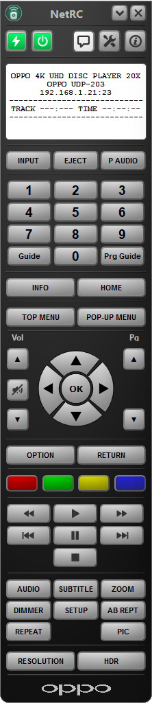
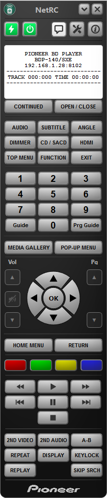
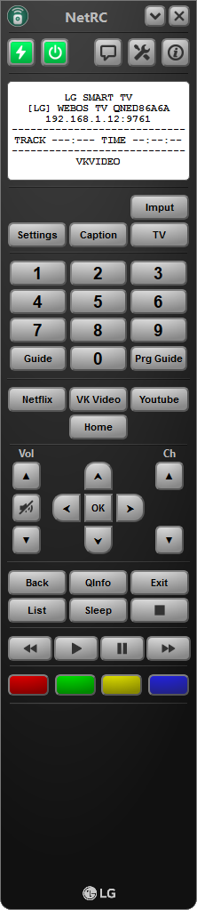
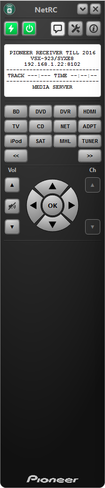

# NetRC. Based on Qt 6.5+
<p align="center">

</p>

Preview | Description
:-------------------------:|:-------------------------:
 | **NetRC** also known as  **Network remote control**. The base idea of this project is to provide access to control your devices via local network. All devices should be configurable without changes in source code. All you need is to create device configuration file. Load it into application and control your device via network. Based on ideas and code from this project https://sourceforge.net/projects/avrpioremote/<br><br><br><br><br><br><br><br>


# Some files from another repository are needed for compilation

Just run

```shell
git submodule init
git submodule update
```

# NetRC Integration steps
* Create configuration file to control your device. When you know how to control your devices via network then you can create [device protocol file](settings/)
and map buttons from this program to your device (more details will be provided soon).
Some useful files for make device protocol JSON configuration file can be found [here](doc/rfc/)

1. Create Device protocol file description 
    * [Connection settings](doc/HowTo/Step0/README.md)
    * Predefined buttons / panels [TBD]
    * Custom buttons / panels [TBD]
1. Load Device protocol file description [TBD]
1. Connect To Device /  Auto Search Device [TBD]

# Tested device


