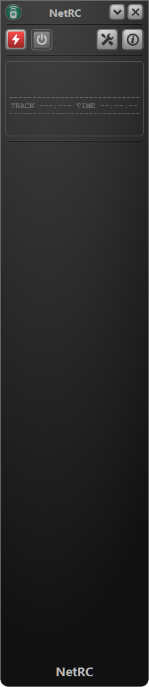
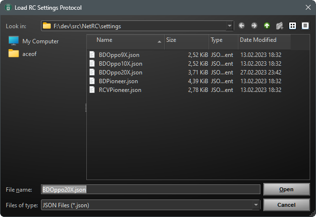
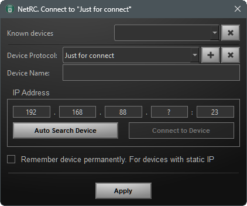
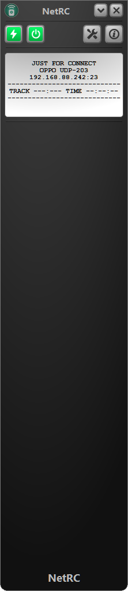

# How to setup your application

What do You see from the scratch



Just click on icon with  and select settings folder 



Click on icon with plus udner "Device Protocol" and select desired file
## Select file with wanted config and load it into application
### Predefined configurations are stored in ./settings folder 

BDP players

* Oppo 9x
* Oppo 10x
* Pioneer 

UHD BDP players
* Oppo 20x

Reciever
* Pioneer Receiver till 2016"


#### Minimal custom configuration file sample

Just edit it or create for Your purposes

```
{
   "powerOff":"#POW",
   "powerOn":"#POW",

   "pingCommands":[
      "#QPW"
   ],
   "pingResponseErr":"QPW OK OFF",
   "pingResponseOk":"QPW OK ON",
   "prefferedPort":23,
   "crlf":true,
   "family":"Just for connect"
} 
```

##### Select your configuration file


Select file with settings and click open

### Apply your settings

Try one of two options 

* click Auto search and select device


Or type your device IP

* replace question sign with digits



#### Result

Predefined | Custom
----------- | ------------
 |   
