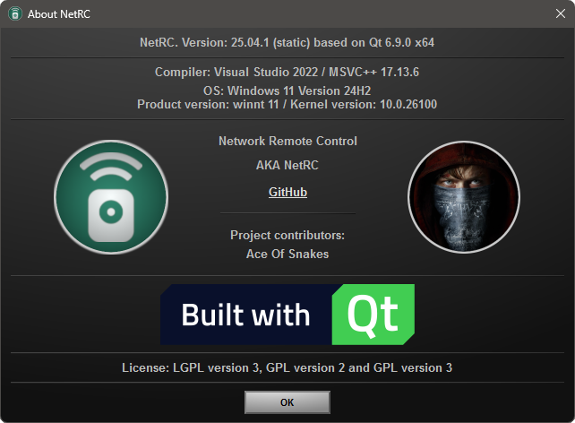
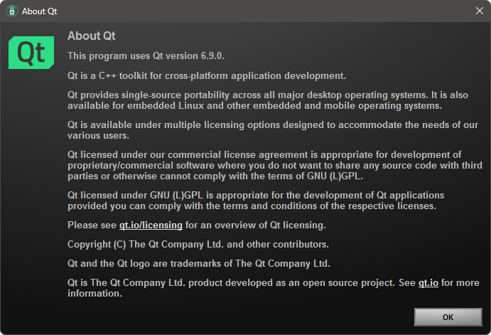
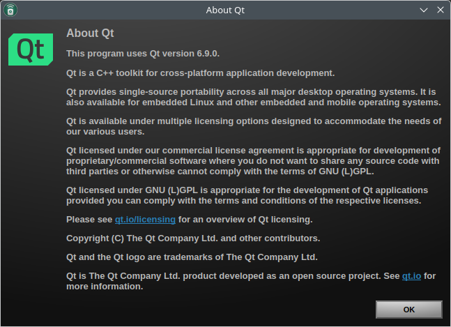
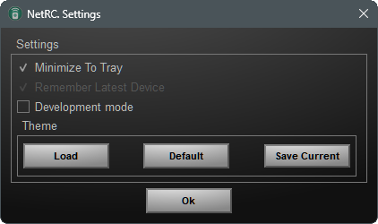
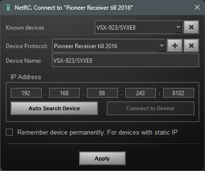
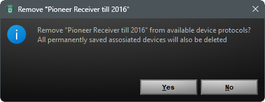
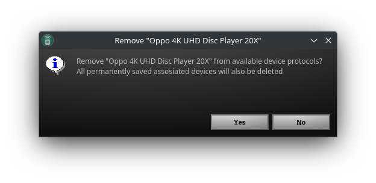
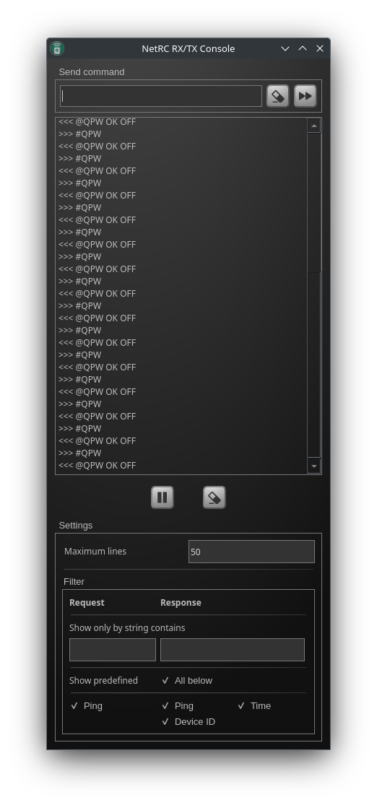
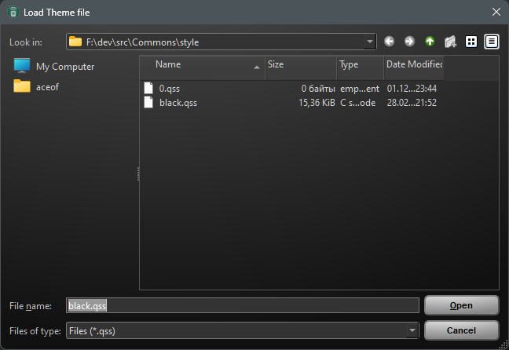

# Development screenshots

[Try to use common styles for all of applications](https://github.com/AceOfSnakes/Commons/tree/master/style)

[Windows 11](w11/) | [Ubuntu 22.04](linux/)  | Qt 6.5
------------ | ------------ | ------------ 
 |  |  
 |  |  |
 | 
 | 
 | 
 | 
 |  |  
 |   |  

