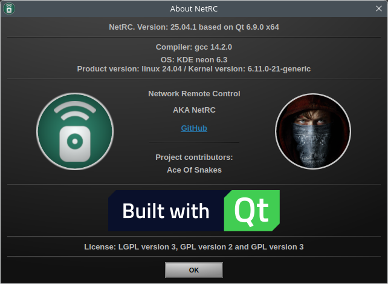
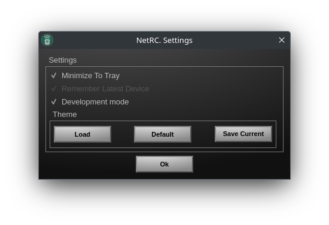
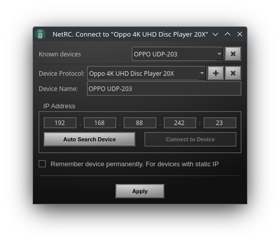
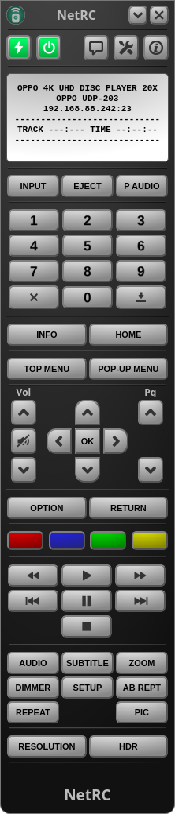
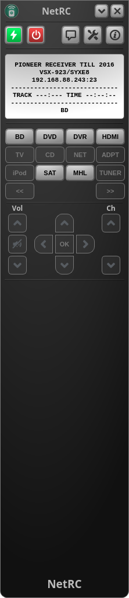

# Ubuntu 22.04
    Distributor ID: Neon
    Description:    KDE neon 5.26
    Release:        22.04
    Codename:       jammy
    
    

# Settings
 

# Connect to device
Connect and add | Auto search | Remove device protocol
:-------------------------:|:-------------------------:|:-------------------------:
 |  | 

# Development mode

# Known devices
[OPPO UDP-203](../OPPO_UDP-203) | [Pioneer BDP-140](../Pioneer_BDP-140) | [Pioneer VSX-923](../Pioneer_VSX923) | [Pioneer VSX-923 Pass Trough](../Pioneer_VSX923)
:-------------------------:|:-------------------------:|:-------------------------:|:-------------------------:
 |  |  | 

