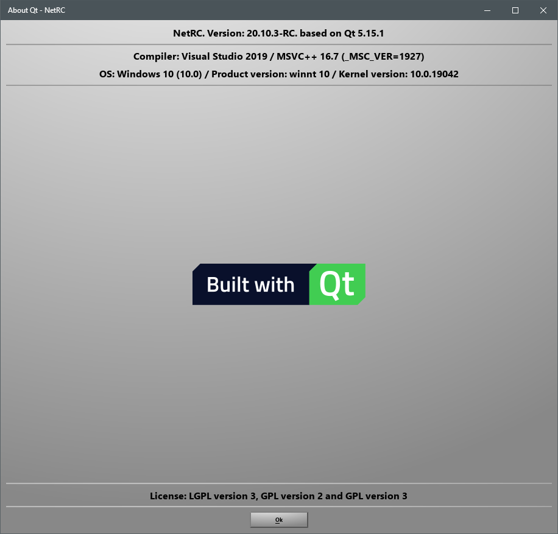
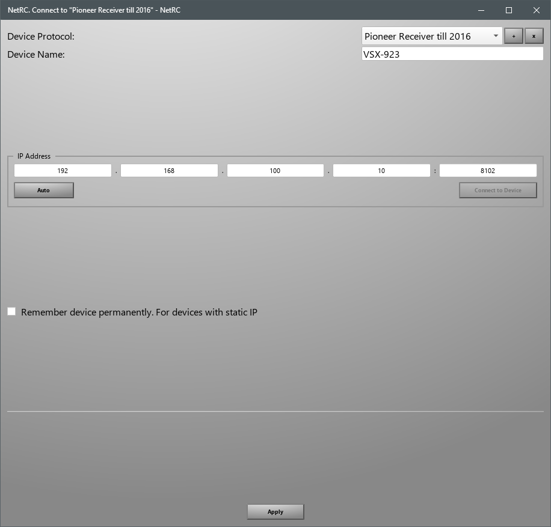
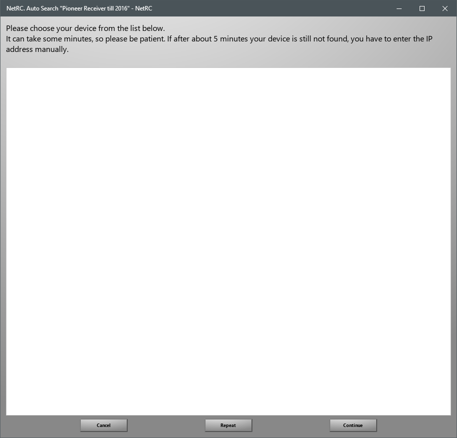
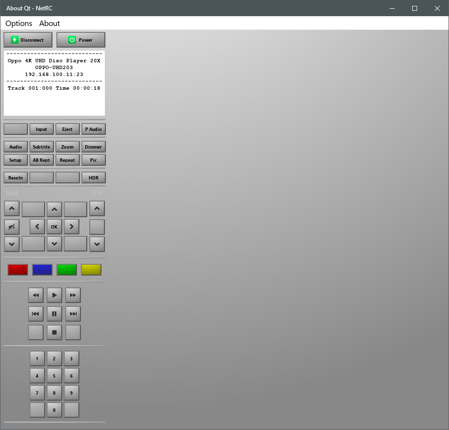
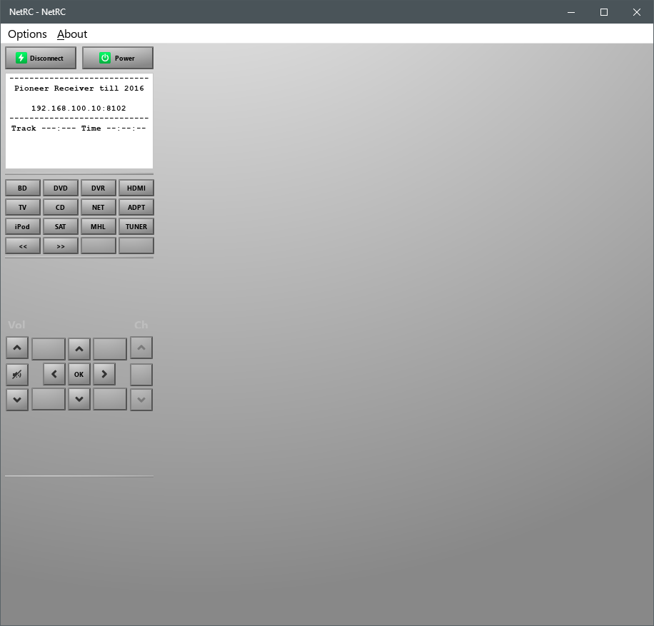

# [About](https://github.com/AceOfSnakes/NetRC/tree/master/doc/About.md)
	UWP

        Preview. Just PoC

# Connect to device
Connect and add / remove device protocol 
 

# Auto search. Dosn't work

# Known devices
[OPPO UDP-203](https://github.com/AceOfSnakes/NetRC/tree/master/doc/OPPO_UDP-203) |
:---------------:|

[Pioneer VSX-923](https://github.com/AceOfSnakes/NetRC/tree/master/doc/Pioneer_VSX923) |
:---------------:|

