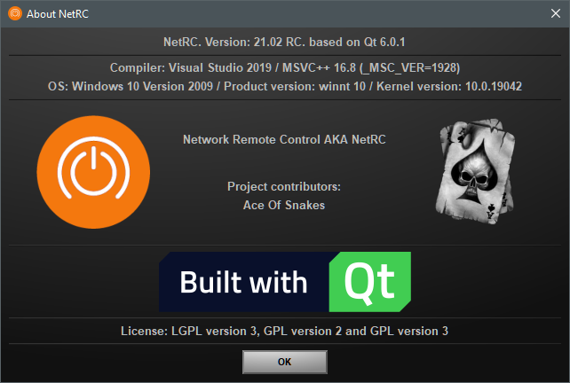
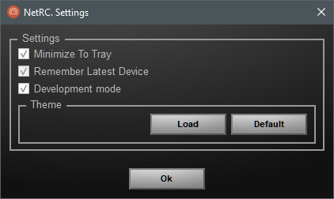
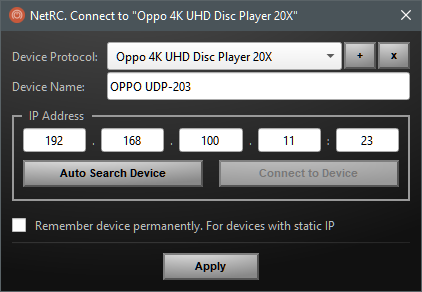
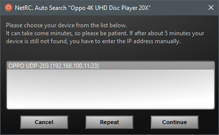
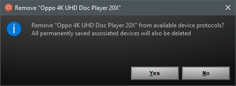
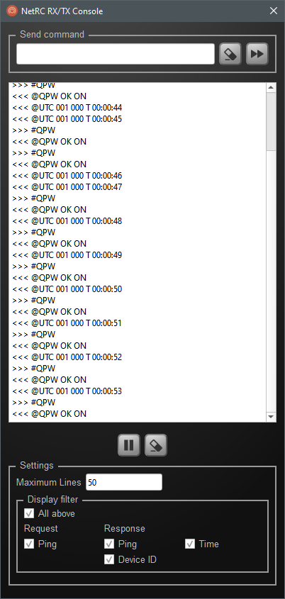
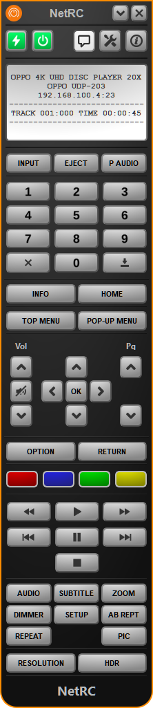
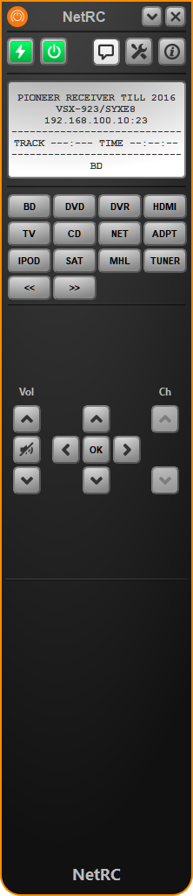

# Windows 10
    Windows
    Edition     Windows 10 Pro
    Version	21H1
    OS build    19043.867

# Settings
 

# Connect to device
Connect and add | Auto search | Remove device protocol
:-------------------------:|:-------------------------:|:-------------------------:
 |  | 

# Development mode

# Known devices
[OPPO UDP-203](../OPPO_UDP-203) | [Pioneer BDP-140](../Pioneer_BDP-140) | [Pioneer VSX-923](../Pioneer_VSX923)
:-------------------------:|:-------------------------:
 |  | 

