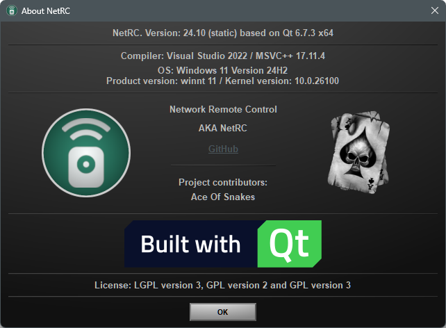
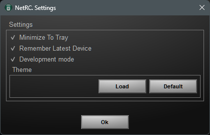
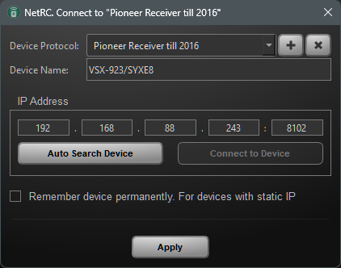
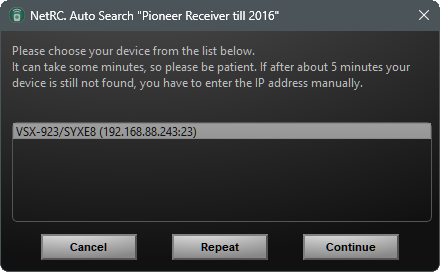
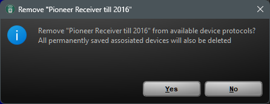
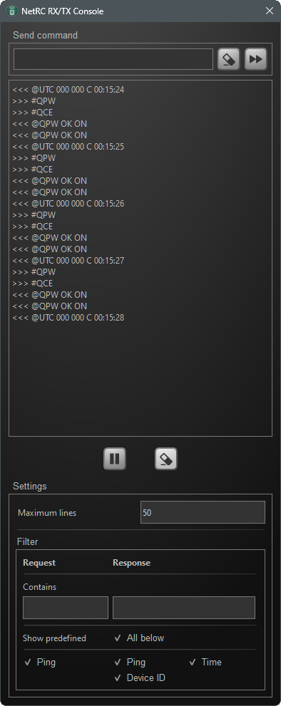
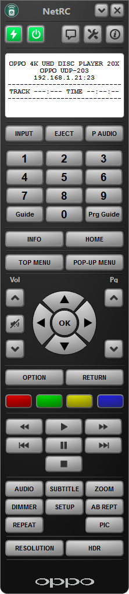
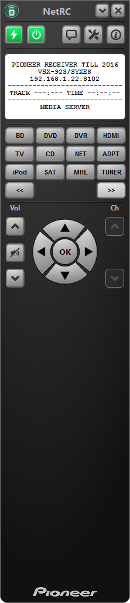
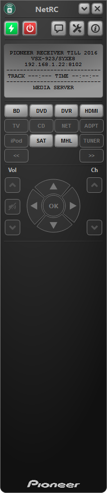
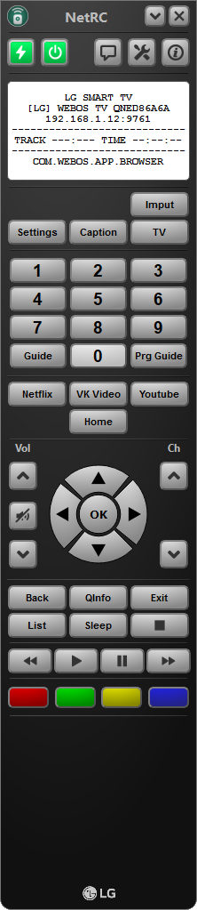

# Windows 11
    Windows
    Edition     Windows 11 Pro
    Version	    25H2
    OS build    26200

# Settings
 

# Connect to device
Connect and add | Auto search | Remove device protocol
:-------------------------:|:-------------------------:|:-------------------------:
 |  | 

# Development mode

# Known devices
[OPPO UDP-203](../OPPO_UDP-203) | [Pioneer BDP-140](../Pioneer_BDP-140) | [Pioneer VSX-923](../Pioneer_VSX923) | [Pioneer VSX-923 Pass Trough](../Pioneer_VSX923) | [LG-QNED86A6A](../LG-QNED86A6A)
:-------------------------:|:-------------------------:|:-------------------------:|:-------------------------:|:-------------------------:
 |  |  |  |  

